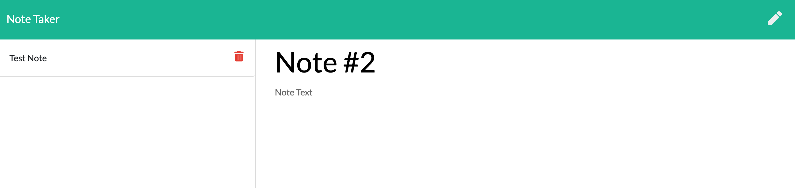

# Note Taker

​
#### Created On: 08/1/2020  

Link to app: https://ancient-thicket-36320.herokuapp.com/notes
​
## Creators
Matt Wieciech  

## Description
Back-end node based app where you can save and delete notes with a front end interface through a browser
## Table of Contents
* [Installation](#installation)
* [Usage](#usage)
* [License](#license)
* [Questions](#questions)

## Installation
1. Open app in browser

## Usage
Take and delete notes

## License
This project is convered under the MIT License.

## Questions
For questions about this project, please see my GitHub at [wheaties5588](https://github.com/wheaties5588), or reach out by email at matt.wieciech@gmail.com.